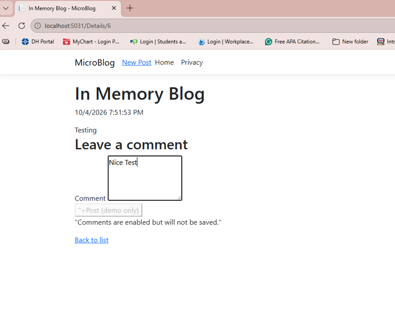
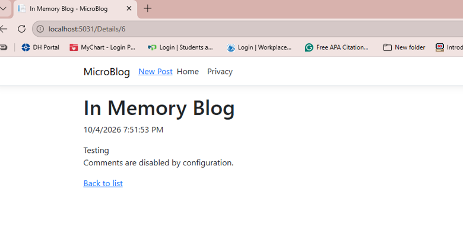
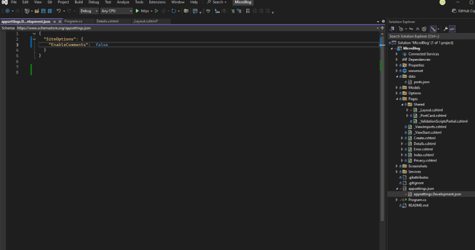

# MicroBlogConfig

This project builds on last week's MicroBlog app and adds the Options pattern to read site settings from configuration. The site name and the comment form are both controlled by `appsettings` files, and the Development environment overrides Production.

## How It Works

I added a `SiteOptions` class with two settings:

```csharp
public class SiteOptions
{
    public string SiteName { get; set; }
    public bool EnableComments { get; set; }
}
```

In `Program.cs`, the class is bound to the `SiteOptions` section of the config:

```csharp
builder.Services.Configure<SiteOptions>(
    builder.Configuration.GetSection("SiteOptions"));
```

Pages read the values by injecting `IOptions<SiteOptions>`.

## Config Settings

| Setting | Purpose | appsettings.json | appsettings.Development.json |
|---|---|---|---|
| `SiteName` | Name shown in the navbar and page title in `_Layout.cshtml` | My Micro Blog | (inherited) |
| `EnableComments` | Shows or hides the "Leave a comment" form on the post Details page | false | true |

**appsettings.json** (base / Production)

```json
"SiteOptions": {
  "SiteName": "My Micro Blog",
  "EnableComments": false
}
```

**appsettings.Development.json** (overrides the base file in Development)

```json
"SiteOptions": {
  "EnableComments": true
}
```

ASP.NET Core loads `appsettings.json` first, then the environment file on top of it. Only the values in the environment file change. Everything else comes from the base file.

## Running Each Environment

- **Development:** Run from Visual Studio (F5). The launch profile sets `ASPNETCORE_ENVIRONMENT=Development`, so the comment form shows.
- **Production:** Run `dotnet run --environment Production` from the project folder, or change `ASPNETCORE_ENVIRONMENT` to `Production` in `Properties/launchSettings.json`. The comment form is hidden and the page says comments are disabled.

## Screenshots

### Development (EnableComments = true)

The "Leave a comment" form shows on the post Details page.



### Production (EnableComments = false)

The comment form is hidden and the page says comments are disabled.



### Development Config File

`appsettings.Development.json` sets `EnableComments` to true, which overrides the base file.



## Repository

https://github.com/alminett1/MicroBlogConfig
