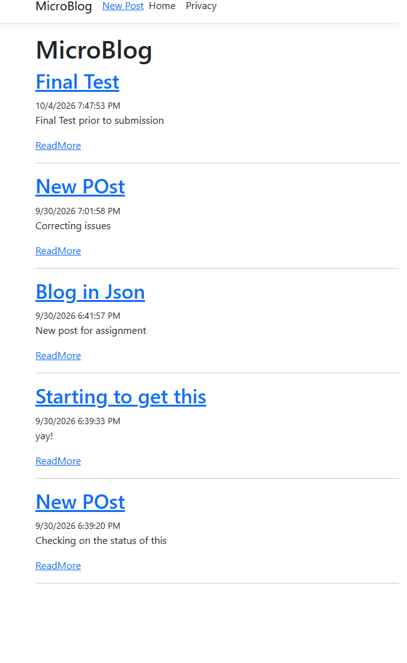

MicroBlog - Repository Pattern & Dependency Injection
This is my MicroBlog app from Week 4, updated to use the repository pattern with dependency injection (DI). The pages no longer depend on one specific storage class. Instead, they ask for an `IBlogRepository`, and `Program.cs` decides which version they get. That makes it easy to swap between saving posts to a JSON file and keeping them in memory.
What changed from Week 4
Added an `IBlogRepository` interface with `GetAll()`, `GetById()`, `Add()`, and `Save()`
Added two classes that implement the interface:
`InMemoryBlogRepository` stores posts in a `List<Post>`. Posts are lost when the app stops.
`JsonBlogRepository` reads and writes posts to `data/posts.json`. Posts are kept after the app restarts.
Registered the repository in the DI container in `Program.cs`
The Index, Create, and Details pages receive `IBlogRepository` through constructor injection instead of using a static list or a specific class
How to switch repositories
Open `Program.cs` and find the repository registration:
```csharp
builder.Services.AddSingleton<IBlogRepository, JsonBlogRepository>();
// builder.Services.AddSingleton<IBlogRepository, InMemoryBlogRepository>();
```
To use the JSON file (default): leave it as shown above.
To use in-memory storage: comment out the JSON line and uncomment the in-memory line:
```csharp
// builder.Services.AddSingleton<IBlogRepository, JsonBlogRepository>();
builder.Services.AddSingleton<IBlogRepository, InMemoryBlogRepository>();
```
Only one line should be active at a time. No page code needs to change, because every page depends on the interface, not the class.
How to tell which one is running
JSON: posts saved in `data/posts.json` show on the home page, and new posts are still there after a restart.
In-memory: the home page starts empty, new posts don't get written to `posts.json`, and they disappear when the app restarts.
How to run it
Open `MicroBlog.sln` in Visual Studio 2022 and press F5, or from a terminal in the project folder:
```
dotnet restore
dotnet run
```
Then open the URL that shows up (something like `https://localhost:7009`).
Screenshot

Where things live
`Models/Post.cs` - the Post model
`Services/IBlogRepository.cs` - the repository interface
`Services/InMemoryBlogRepository.cs` - in-memory version (List)
`Services/JsonBlogRepository.cs` - JSON file version (`data/posts.json`)
`Program.cs` - DI registration (where you switch repositories)
`Pages/Index.cshtml` - lists all posts
`Pages/Create.cshtml` - form for adding a post
`Pages/Details.cshtml` - single post view
`Pages/Shared/_Layout.cshtml` - shared layout and navbar
`Pages/Shared/_PostCard.cshtml` - reusable post preview
Built with
ASP.NET Core Razor Pages (.NET 9)
System.Text.Json for reading/writing the posts file